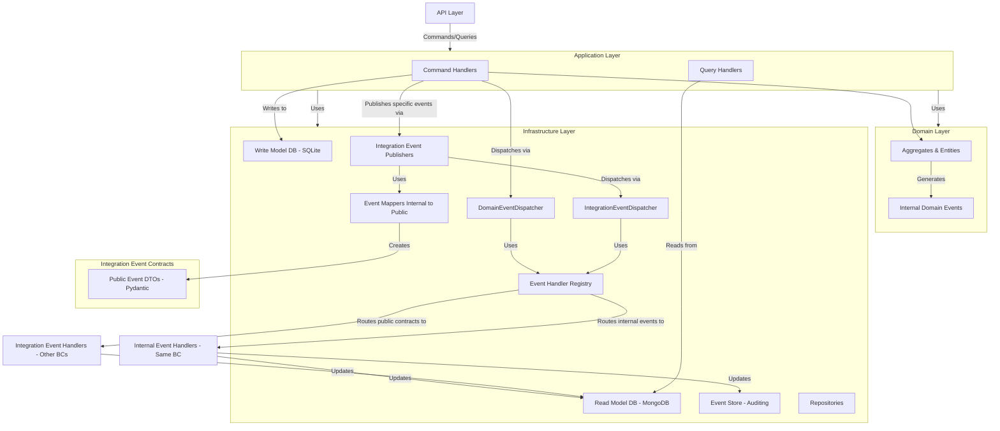
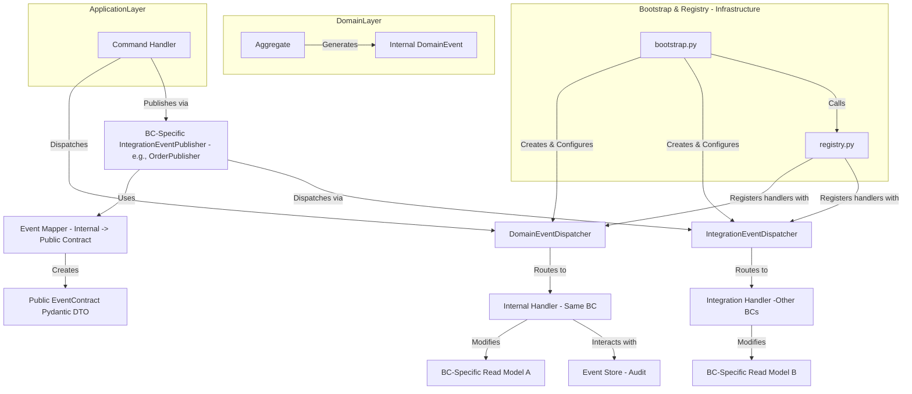

# E-Commerce DDD, CQRS, and Event Sourcing

This project implements a simple e-commerce system using Domain-Driven Design (DDD), Command Query Responsibility Segregation (CQRS), and event-driven patterns. The application is built as a monolith with two main domains: Orders and Customers, designed with eventual microservice extraction in mind.

## Table of Contents

- [E-Commerce DDD, CQRS, and Event Sourcing](#e-commerce-ddd-cqrs-and-event-sourcing)
  - [Table of Contents](#table-of-contents)
  - [Architecture Overview](#architecture-overview)
  - [DDD Implementation](#ddd-implementation)
    - [Domain Entities and Aggregates](#domain-entities-and-aggregates)
    - [Domain Events (Internal)](#domain-events-internal)
  - [CQRS Implementation](#cqrs-implementation)
    - [Commands and Command Handlers](#commands-and-command-handlers)
    - [Queries and Query Handlers](#queries-and-query-handlers)
    - [Read and Write Models](#read-and-write-models)
  - [Event Handling System (Dual Dispatcher)](#event-handling-system-dual-dispatcher)
    - [1. Domain Event Dispatcher (Internal Events)](#1-domain-event-dispatcher-internal-events)
    - [2. Integration Event Dispatcher (Public Contract Events)](#2-integration-event-dispatcher-public-contract-events)
    - [Event Dispatcher Configuration \& Registration](#event-dispatcher-configuration--registration)
  - [Integration Events: Public Contracts \& Publishers](#integration-events-public-contracts--publishers)
    - [Public Event Contracts](#public-event-contracts)
    - [Internal-to-Public Event Mapping](#internal-to-public-event-mapping)
    - [Integration Event Publishers](#integration-event-publishers)
    - [Cross-Domain Communication Flow (with Integration Events)](#cross-domain-communication-flow-with-integration-events)
  - [Event Storage/Auditing (EventStore)](#event-storageauditing-eventstore)
  - [Project Structure Overview](#project-structure-overview)

## Architecture Overview

The application follows a layered architecture, separating concerns to promote maintainability and scalability.



**Key Layers:**

1.  **API Layer**: Exposes HTTP endpoints (FastAPI). Converts HTTP requests to Commands or Queries.
2.  **Application Layer**: Orchestrates use cases. Contains Command Handlers and Query Handlers. It uses the Domain Layer for business logic and the Infrastructure Layer for persistence and other services.
3.  **Domain Layer**: The heart of the business logic. Contains Aggregates, Entities, Value Objects, and *internal* Domain Events. This layer is independent of other layers.
4.  **Infrastructure Layer**: Provides technical implementations for cross-cutting concerns like database access (Repositories), event dispatching (both internal and integration), event publishing, and external service integrations.
5.  **Integration Contracts Layer**: Defines the public, shared event DTOs (Pydantic models) that are used for communication *between* bounded contexts.

## DDD Implementation

### Domain Entities and Aggregates

Domain logic is encapsulated within Entities and Aggregates. `AggregateRoot` is a base class for aggregates, providing a mechanism to collect domain events.

```python
# src/domain/core/AggregateRoot.py
class AggregateRoot(Entity):
    def __init__(self):
        self._domain_events: List[DomainEvent] = [] # Internal domain events

    def add_domain_event(self, event: DomainEvent):
        self._domain_events.append(event)
    # ... other methods
```

### Domain Events (Internal)

These events represent significant occurrences *within a specific domain*. They are simple data classes inheriting from a base `DomainEvent` and are handled by the `DomainEventDispatcher`.

```python
# src/domain/core/events/DomainEvent.py
class DomainEvent(Message): # Assuming Message is a common base
    # ... common event properties
    pass

# Example: src/domain/orders/events/OrderPlacedEvent.py
class OrderPlacedEvent(DomainEvent): # Internal event
    # ... order specific details
    pass
```
Examples: `OrderPlacedEvent` (internal to Orders), `CustomerRegisteredEvent` (internal to Customers).

## CQRS Implementation

Commands (write operations) and Queries (read operations) are strictly separated.

### Commands and Command Handlers

Commands express an intent to change the state of the system. Command Handlers process these commands, interact with Aggregates, and utilize repositories for persistence. They are now also responsible for explicitly deciding which internal events should be published as public integration events.

```python
# src/application/orders/commands/PlaceOrderCommand.py
class PlaceOrderCommand(BaseModel):
    customer_id: UUID
    items: list[OrderItem]

# src/application/orders/commands/PlaceOrderHandler.py
class PlaceOrderHandler:
    def __init__(
        self, 
        write_repository: IOrderWriteRepository, 
        domain_event_dispatcher: DomainEventDispatcher, # For internal events
        integration_event_publisher: OrderIntegrationEventPublisher # For publishing public events
    ):
        # ...
    async def handle(self, command: PlaceOrderCommand):
        # 1. Create/load Order Aggregate
        # 2. Execute business logic on Aggregate (which generates internal domain events)
        # 3. Save Aggregate via Write Repository
        # 4. Dispatch generated internal Domain Events (using domain_event_dispatcher)
        # 5. For specific internal events, explicitly publish them as public integration events
        #    (using integration_event_publisher, which maps and uses IntegrationEventDispatcher)
        for event in order.domain_events:
            await self._domain_event_dispatcher.dispatch(event) # Internal dispatch
            if isinstance(event, InternalOrderPlacedEvent): # InternalOrderPlacedEvent is an alias
                 await self._integration_event_publisher.publish(event) # Publish as public contract
```

### Queries and Query Handlers

Queries are used to retrieve data for presentation. Query Handlers directly fetch data from the Read Model (e.g., MongoDB) without involving domain aggregates. (This part remains largely unchanged).

### Read and Write Models

The system uses separate data stores:
*   **Write Model**: SQLite (via SQLAlchemy) for transactional consistency for aggregates.
*   **Read Model**: MongoDB for optimized querying and denormalized views.

## Event Handling System (Dual Dispatcher)

The system now employs a dual dispatcher mechanism to clearly separate the handling of internal domain events from public integration events.



### 1. Domain Event Dispatcher (Internal Events)

*   **Path:** `src/domain/core/events/DomainEventDispatcher.py`
*   **Responsibility:** Handles `DomainEvent` subclasses that are internal to a bounded context. It notifies handlers *within the same bounded context*.
*   **Registration:** Handlers for these internal events are registered with this dispatcher via `registry.py`.

### 2. Integration Event Dispatcher (Public Contract Events)

*   **Path:** `src/infrastructure/core/events/integration_event_dispatcher.py`
*   **Responsibility:** Handles public `EventContractVx` (Pydantic models) that are designed for cross-bounded context communication. It simulates a message bus, notifying handlers in *other bounded contexts* that subscribe to these public contracts.
*   **Registration:** Handlers in one BC that consume public event contracts from another BC are registered with this dispatcher via `registry.py`.

### Event Dispatcher Configuration & Registration

1.  **Bootstrap (`src/infrastructure/core/events/bootstrap.py`):**
    *   `create_domain_event_dispatcher(container)`: Creates the `DomainEventDispatcher` and registers essential global handlers (like `EventStoreHandler` for auditing internal events).
    *   `create_integration_event_dispatcher()`: Creates the `IntegrationEventDispatcher`.
    *   `register_all_event_handlers(domain_dispatcher, integration_dispatcher, container)`: Calls functions in `registry.py` to register all domain-specific and integration handlers with their respective dispatchers.

2.  **Registry (`src/infrastructure/core/events/registry.py`):**
    *   Contains functions like `register_customer_event_handlers(...)` and `register_order_event_handlers(...)`.
    *   These functions now accept both `domain_event_dispatcher` and `integration_event_dispatcher`.
    *   **Internal handlers** (reacting to `DomainEvent` within the same BC) are registered with the `domain_event_dispatcher`.
    *   **Integration handlers** (reacting to public `EventContractVx` from other BCs) are registered with the `integration_event_dispatcher`.

    ```python
    # src/infrastructure/core/events/registry.py (Conceptual)
    def register_customer_event_handlers(
        domain_event_dispatcher: DomainEventDispatcher,
        integration_event_dispatcher: IntegrationEventDispatcher,
        container: dict
    ):
        # Handler for internal CustomerRegisteredEvent
        domain_event_dispatcher.register_handler(
            InternalCustomerRegisteredEvent, 
            CustomerInternalHandler(container.get("..."))
        )
        # Handler for public OrderPlacedEventContractV1 from Orders BC
        integration_event_dispatcher.register_handler(
            OrderPlacedEventContractV1, 
            CustomerReactsToOrderHandler(container.get("..."))
        )
    ```

3.  **Application Startup (`src/main.py`):**
    During FastAPI lifespan setup:
    *   The two dispatchers are created using functions from `bootstrap.py`.
    *   All handlers are registered using `register_all_event_handlers` from `bootstrap.py`.
    *   The dispatchers (and relevant publishers) are stored (e.g., in `app.state`) to be accessible via API dependencies.

## Integration Events: Public Contracts & Publishers

To facilitate clean, decoupled communication between bounded contexts (even within the monolith, preparing for microservices), a formal system for public integration events is established.

### Public Event Contracts

*   **Location:** `src/integration_contracts/events/` (e.g., `order_events.py`, `customer_events.py`)
*   **Definition:** These are Pydantic models (e.g., `OrderPlacedEventContractV1`) that define the schema for events shared across bounded context boundaries. They act as Data Transfer Objects (DTOs).
*   **Purpose:** Provide a stable, explicit contract that consuming domains can rely on, avoiding direct dependencies on internal domain event classes from other contexts.

```python
# src/integration_contracts/events/order_events.py
from pydantic import BaseModel, UUID
from datetime import datetime

class OrderItemContract(BaseModel):
    product_id: UUID
    quantity: int
    unit_price: float

class OrderPlacedEventContractV1(BaseModel):
    event_id: UUID
    event_type: str = "OrderPlacedEvent.v1"
    occurred_on: datetime
    order_id: UUID
    customer_id: UUID
    items: List[OrderItemContract]
    total_price: float
```

### Internal-to-Public Event Mapping

*   **Location:** Within the infrastructure layer of the publishing domain (e.g., `src/infrastructure/orders/event_mapping/mappers.py`).
*   **Responsibility:** Functions that take an internal domain event (e.g., `InternalOrderPlacedEvent`) and transform it into its corresponding public event contract DTO (e.g., `OrderPlacedEventContractV1`).

```python
# src/infrastructure/orders/event_mapping/mappers.py
from domain.orders.events.OrderPlacedEvent import OrderPlacedEvent as InternalOrderPlacedEvent
from integration_contracts.events.order_events import OrderPlacedEventContractV1, OrderItemContract

def map_internal_order_placed_to_v1_contract(event: InternalOrderPlacedEvent) -> OrderPlacedEventContractV1:
    return OrderPlacedEventContractV1(
        event_id=event.id, # Assuming internal event has an id
        occurred_on=event.occurred_on,
        order_id=event.aggregate_id,
        customer_id=event.customer_id,
        items=[OrderItemContract(**item.model_dump()) for item in event.items], # Or item.dict()
        total_price=event.total_price
    )
```

### Integration Event Publishers

*   **Location:** Within the infrastructure layer of the publishing domain (e.g., `src/infrastructure/orders/event_publishing/order_integration_event_publisher.py`).
*   **Responsibility:**
    1.  Takes a specific internal domain event from its command handler.
    2.  Uses a registered mapper function to convert the internal event to its public contract DTO.
    3.  Uses the `IntegrationEventDispatcher` to "broadcast" this public contract DTO to any interested subscribers in other bounded contexts.
*   **Invocation:** Command Handlers explicitly call the `publish(internal_event)` method of these publishers for internal events that need to be made public.

```python
# src/infrastructure/orders/event_publishing/order_integration_event_publisher.py
class OrderIntegrationEventPublisher:
    def __init__(self, integration_event_dispatcher: IntegrationEventDispatcher):
        self._integration_event_dispatcher = integration_event_dispatcher
        self._mappers = {
            InternalOrderPlacedEvent: map_internal_order_placed_to_v1_contract,
            # ... other mappers
        }

    async def publish(self, internal_event: DomainEvent):
        mapper = self._mappers.get(type(internal_event))
        if mapper:
            public_contract = mapper(internal_event)
            if public_contract:
                await self._integration_event_dispatcher.dispatch(public_contract)
```

### Cross-Domain Communication Flow (with Integration Events)

1.  **Origin:** An action in `Domain A` (e.g., Order placed) generates an `InternalDomainEventA`.
2.  **Internal Dispatch:** `CommandHandlerA` dispatches `InternalDomainEventA` via `DomainEventDispatcher` for listeners *within Domain A*.
3.  **Explicit Publish Decision:** `CommandHandlerA` decides `InternalDomainEventA` needs to be public and calls `DomainAIntegrationEventPublisher.publish(InternalDomainEventA)`.
4.  **Mapping:** `DomainAIntegrationEventPublisher` looks up a mapper for `InternalDomainEventA`, converts it to `PublicEventContractA_V1`.
5.  **Public Dispatch:** `DomainAIntegrationEventPublisher` uses `IntegrationEventDispatcher` to dispatch `PublicEventContractA_V1`.
6.  **Subscription & Handling:** `DomainBIntegrationHandler` (in `Domain B`), which is registered with the `IntegrationEventDispatcher` to listen for `PublicEventContractA_V1`, receives the contract.
7.  **Action:** `DomainBIntegrationHandler` processes the public contract and performs actions in `Domain B`.

This approach ensures that `Domain B` only depends on the stable `PublicEventContractA_V1` from `src/integration_contracts`, not on the internal details or event classes of `Domain A`.

## Event Storage/Auditing (EventStore)

*   An `EventStoreHandler` is registered with the `DomainEventDispatcher` (typically for the base `DomainEvent` type).
*   Its responsibility is to persist all *internal* domain events to a dedicated store (e.g., could be a separate table/collection). This provides an audit trail and can be used for debugging or replaying events if needed (though full event sourcing for state reconstruction is not the primary focus here).
*   The current `EventStore` is a simple in-memory store for demonstration but can be replaced with a persistent implementation.

## Project Structure Overview

```
src/
├── api/                         # FastAPI routers, request/response models, dependencies
│   ├── customers/
│   └── orders/
│   └── dependencies.py
├── application/                 # Application services (Command/Query Handlers)
│   ├── customers/
│   │   ├── commands/
│   │   └── queries/
│   └── orders/
│       ├── commands/            # e.g., PlaceOrderHandler.py
│       └── queries/
├── domain/                      # Core business logic, independent of infrastructure
│   ├── core/                    # Shared domain concepts (AggregateRoot, DomainEvent, etc.)
│   │   └── events/              # DomainEvent.py, DomainEventDispatcher.py
│   ├── customers/               # Customer Bounded Context
│   │   ├── events/              # e.g., CustomerRegisteredEvent.py (Internal)
│   │   ├── models/              # Customer Aggregate, Entities
│   │   └── repositories/        # Interfaces for customer repositories (IWrite, IRead)
│   │   └── events/
│   │       └── handlers/        # Handlers for events WITHIN Customer BC
│   │           └── integration/ # Handlers for events FROM OTHER BCs (consuming public contracts)
│   └── orders/                  # Order Bounded Context
│       ├── events/              # e.g., OrderPlacedEvent.py (Internal)
│       ├── models/              # Order Aggregate, Entities
│       └── repositories/        # Interfaces for order repositories
│       └── events/
│           └── handlers/        # Handlers for events WITHIN Order BC
├── infrastructure/              # Implementation of external concerns
│   ├── core/                    # Shared infrastructure (settings, DB base, core event components)
│   │   ├── events/              # Event bootstrap, registry, IntegrationEventDispatcher
│   │   │   ├── bootstrap.py
│   │   │   ├── integration_event_dispatcher.py
│   │   │   └── registry.py
│   │   ├── persistence/
│   │   └── settings.py
│   ├── customers/               # Customer BC specific infrastructure
│   │   ├── persistence/         # SQLAlchemy/MongoDB repositories
│   │   └── services/            # e.g., EmailService, AuditService
│   └── orders/                  # Order BC specific infrastructure
│       ├── event_mapping/       # Mappers from internal Order events to public contracts
│       │   └── mappers.py
│       ├── event_publishing/    # OrderIntegrationEventPublisher
│       │   └── order_integration_event_publisher.py
│       └── persistence/         # SQLAlchemy/MongoDB repositories
├── integration_contracts/       # Public event contracts (Pydantic DTOs) for cross-BC communication
│   └── events/
│       ├── common_base.py       # (Optional) Base for public contracts
│       ├── order_events.py      # e.g., OrderPlacedEventContractV1
│       └── customer_events.py   # e.g., CustomerRegisteredEventContractV1
├── tests/                       # Unit and integration tests
└── main.py                      # FastAPI application entry point & lifespan management
```

(The rest of the README content like setup, running, testing instructions can follow)
