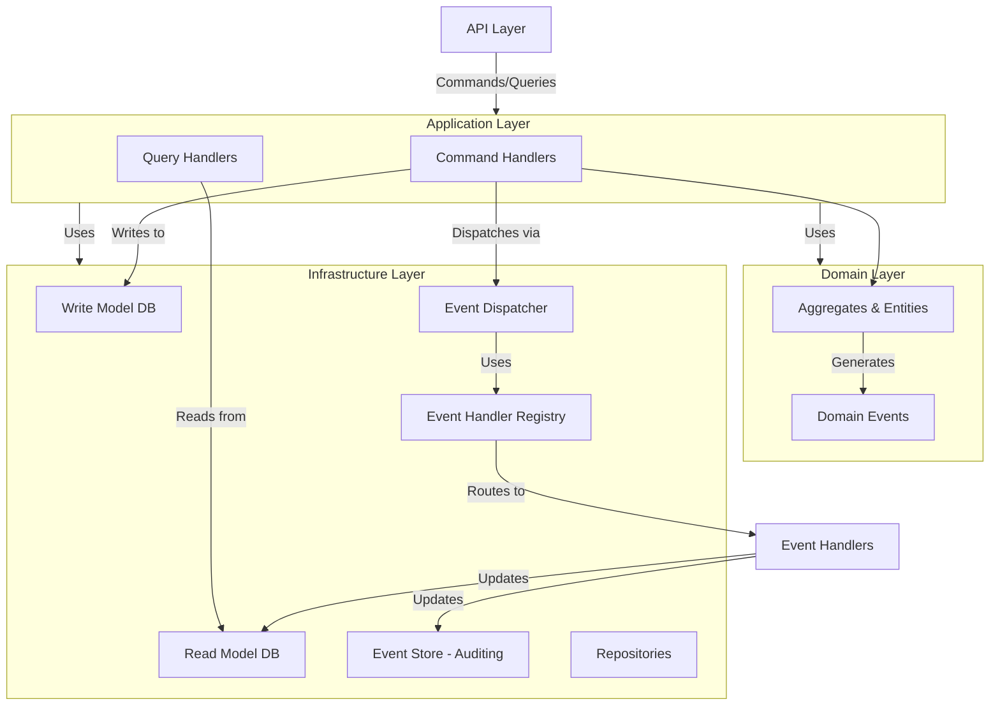
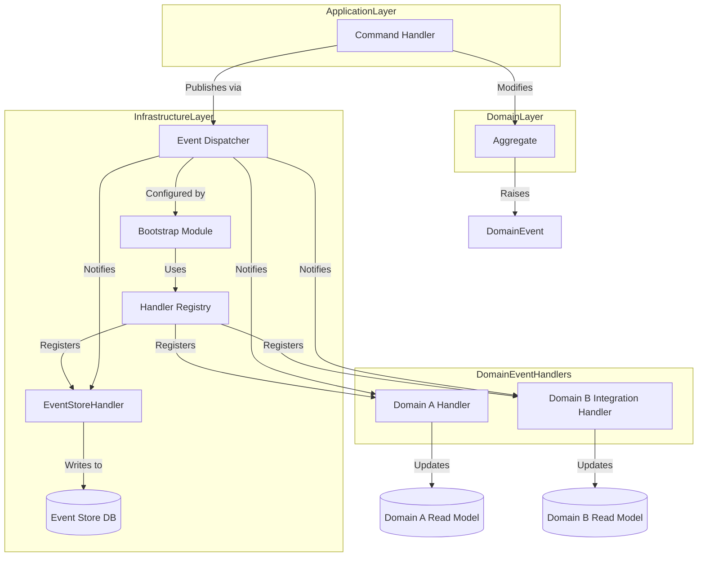

# E-Commerce DDD, CQRS, and Event Sourcing

This project implements a simple e-commerce system using Domain-Driven Design (DDD), Command Query Responsibility Segregation (CQRS), and event-driven patterns. The application is built as a monolith with two main domains: Orders and Customers.

## Table of Contents

- [E-Commerce DDD, CQRS, and Event Sourcing](#e-commerce-ddd-cqrs-and-event-sourcing)
  - [Table of Contents](#table-of-contents)
  - [Architecture Overview](#architecture-overview)
  - [DDD Implementation](#ddd-implementation)
    - [Domain Entities and Aggregates](#domain-entities-and-aggregates)
    - [Domain Events](#domain-events)
  - [CQRS Implementation](#cqrs-implementation)
    - [Commands and Command Handlers](#commands-and-command-handlers)
    - [Queries and Query Handlers](#queries-and-query-handlers)
    - [Read and Write Models](#read-and-write-models)
  - [Event Handling System](#event-handling-system)
    - [Event Dispatcher Configuration](#event-dispatcher-configuration)
  - [Cross-Domain Communication](#cross-domain-communication)
  - [Current Event Storage/Auditing](#current-event-storageauditing)
  - [Project Structure](#project-structure)

## Architecture Overview

The application follows a layered architecture, separating concerns to promote maintainability and scalability.



**Key Layers:**

1.  **API Layer**: Exposes HTTP endpoints (FastAPI). Converts HTTP requests to Commands or Queries.
2.  **Application Layer**: Orchestrates use cases. Contains Command Handlers and Query Handlers. It uses the Domain Layer for business logic and the Infrastructure Layer for persistence and other services.
3.  **Domain Layer**: The heart of the business logic. Contains Aggregates, Entities, Value Objects, and Domain Events. This layer is independent of other layers.
4.  **Infrastructure Layer**: Provides technical implementations for cross-cutting concerns like database access (Repositories), event dispatching, and external service integrations.

## DDD Implementation

### Domain Entities and Aggregates

Domain logic is encapsulated within Entities and Aggregates. `AggregateRoot` is a base class for aggregates, providing a mechanism to collect domain events.

```python
# src/domain/core/AggregateRoot.py
class AggregateRoot(Entity):
    def __init__(self):
        self._domain_events: List[DomainEvent] = []

    def add_domain_event(self, event: DomainEvent):
        self._domain_events.append(event)

    # ... other methods like clear_domain_events, domain_events property
```

### Domain Events

Events represent significant occurrences within the domain. They are simple data classes inheriting from a base `DomainEvent`.

```python
# src/domain/core/events/DomainEvent.py
class DomainEvent(Message): # Assuming Message is a common base
    def __init__(self, aggregate_id: str):
        super().__init__()
        self.aggregate_id = aggregate_id
        self.occurred_on = datetime.now()
```
Examples: `OrderPlacedEvent`, `CustomerRegisteredEvent`.

## CQRS Implementation

Commands (write operations) and Queries (read operations) are strictly separated.

### Commands and Command Handlers

Commands express an intent to change the state of the system. Command Handlers process these commands, interact with Aggregates, and utilize repositories for persistence.

```python
# src/application/orders/commands/PlaceOrderCommand.py
class PlaceOrderCommand(BaseModel):
    customer_id: UUID
    items: list[OrderItem]

# src/application/orders/commands/PlaceOrderHandler.py
class PlaceOrderHandler:
    def __init__(self, write_repository: IOrderWriteRepository, event_dispatcher: DomainEventDispatcher):
        # ...
    async def handle(self, command: PlaceOrderCommand):
        # 1. Create/load Order Aggregate
        # 2. Execute business logic on Aggregate (which generates events)
        # 3. Save Aggregate via Write Repository
        # 4. Dispatch generated Domain Events
```

### Queries and Query Handlers

Queries are used to retrieve data for presentation. Query Handlers directly fetch data from the Read Model (e.g., MongoDB) without involving domain aggregates.

```python
# src/application/orders/queries/GetOrderDetailsQuery.py
class GetOrderDetailsQuery(BaseModel):
    id: UUID

# src/application/orders/queries/GetOrderDetailsHandler.py
class GetOrderDetailsHandler:
    def __init__(self, read_repository: IOrderReadRepository):
        # ...
    async def handle(self, query: GetOrderDetailsQuery):
        return await self._repository.get_order_details(id=query.id)
```

### Read and Write Models

The system uses separate data stores:
*   **Write Model**: SQLite (via SQLAlchemy) for transactional consistency for aggregates.
*   **Read Model**: MongoDB for optimized querying and denormalized views.

## Event Handling System

The event handling system is centralized in the infrastructure layer, promoting loose coupling.



### Event Dispatcher Configuration

1.  **Bootstrap (`infrastructure/core/events/bootstrap.py`):**
    This module is responsible for creating an instance of `DomainEventDispatcher` and registering global handlers (like `EventStoreHandler`). It then calls registry functions to add domain-specific handlers.

2.  **Registry (`infrastructure/core/events/registry.py`):**
    Contains functions like `register_customer_event_handlers` and `register_order_event_handlers`. Each function registers handlers relevant to modifications within *that specific domain*, regardless of where the event originated. Dependencies for handlers are resolved using a simple container.

    ```python
    # src/infrastructure/core/events/registry.py
    def register_customer_event_handlers(dispatcher, container):
        """Register all handlers that modify the CUSTOMER domain"""
        from src.domain.customers.events.CustomerRegisteredEvent import CustomerRegisteredEvent
        from src.domain.orders.events.OrderPlacedEvent import OrderPlacedEvent # External event
        from src.domain.customers.events.handlers.CustomerRegisteredHandlers import UpdateReadModelHandler
        from src.domain.customers.events.handlers.integration.OrderPlacedHandlers import UpdateCustomerHandler # Integration handler
        
        customer_repo = container.get("customer_read_repository")
        dispatcher.register_handler(CustomerRegisteredEvent, UpdateReadModelHandler(customer_repo))
        dispatcher.register_handler(OrderPlacedEvent, UpdateCustomerHandler(customer_repo))
        # ... other handlers modifying Customer domain
    ```

3.  **Application Startup (`src/main.py`):**
    During the FastAPI application's lifespan setup, a dependency container is created, and `configure_dispatcher` (from `bootstrap.py`) is called. The configured dispatcher is stored in `app.state.event_dispatcher`.

    ```python
    # In src/main.py (within lifespan context manager)
    container = {
        "customer_read_repository": CustomerReadRepository(mongo_db_instance),
        "order_read_repository": OrderReadRepository(mongo_db_instance),
        "email_service": EmailService(), # Example services
        "audit_service": AuditService(),
        "event_store": EventStore()
    }
    event_dispatcher = configure_dispatcher(container)
    app.state.event_dispatcher = event_dispatcher
    ```

4.  **API Dependency (`src/api/dependencies.py`):**
    A FastAPI dependency `get_event_dispatcher` provides access to the application-wide dispatcher.

    ```python
    def get_event_dispatcher(request: Request) -> DomainEventDispatcher:
        return request.app.state.event_dispatcher
    ```

## Cross-Domain Communication

When an event in one domain (e.g., `OrderPlacedEvent` in Orders) needs to trigger actions in another domain (e.g., update customer statistics in Customers):

1.  **Integration Handlers:** The consuming domain (Customers) defines handlers for these external events within an `integration` sub-directory (e.g., `src/domain/customers/events/handlers/integration/OrderPlacedHandlers.py`). This handler contains the logic to modify the Customer domain.

2.  **Registration:** This integration handler is registered in the `infrastructure/core/events/registry.py` within the function corresponding to the *consuming domain* (e.g., `register_customer_event_handlers`).

3.  **Loose Coupling:** To avoid direct class dependencies between domains (e.g., Customer domain importing `OrderPlacedEvent` class), integration handlers expect event payloads as dictionary-like objects and access data using `event.get("key")`.

    ```python
    # src/domain/customers/events/handlers/integration/OrderPlacedHandlers.py
    class UpdateCustomerOnOrderPlacedHandler: # (Illustrative name)
        def __init__(self, customer_read_repo: ICustomerReadRepository):
            self._customer_read_repo = customer_read_repo

        async def handle(self, event_data): # event_data is dict-like
            customer_id = event_data.get("customer_id")
            # ... logic to update customer's total_orders, etc.
    ```

## Current Event Storage/Auditing

The project includes a basic `EventStore` (`src/domain/core/events/EventStore.py`). Currently, its primary role is to capture all dispatched domain events via the `EventStoreHandler` (registered globally in `bootstrap.py`). This serves as an audit log of system activities.

It does **not** yet implement full Event Sourcing where aggregates are loaded and rebuilt from their historical stream of events. This is a potential area for future development to make the system more resilient and auditable in a stricter sense.

## Project Structure

```
src/
├── api/                  # FastAPI routers, request/response models, API-specific dependencies
│   ├── customers/
│   ├── orders/
│   └── dependencies.py   # Shared API dependencies (e.g., get_event_dispatcher)
├── application/          # Use cases: Command and Query Handlers
│   ├── customers/
│   │   ├── commands/
│   │   └── queries/
│   └── orders/
│       ├── commands/
│       └── queries/
├── domain/               # Core business logic, independent of other layers
│   ├── core/             # Shared domain concepts (Entity, AggregateRoot, ValueObject, base DomainEvent)
│   │   └── events/
│   ├── customers/        # Customer Bounded Context
│   │   ├── events/       # Customer-specific events (e.g., CustomerRegisteredEvent)
│   │   │   └── handlers/ # Handlers for events
│   │   │       ├── CustomerRegisteredHandlers.py   # Handlers for own domain's events
│   │   │       └── integration/                  # Handlers for external events affecting Customers
│   │   │           └── OrderPlacedHandlers.py    # Example: Customer reacts to OrderPlacedEvent
│   │   ├── models/       # Customer AggregateRoot, Entities, ValueObjects
│   │   └── repositories/ # Interfaces for Customer repositories (ICustomerReadRepository, etc.)
│   └── orders/           # Order Bounded Context
│       ├── events/       # Order-specific events
│       │   └── handlers/ # Handlers for Order domain's events
│       │       └── OrderPlacedHandlers.py
│       ├── models/       # Order AggregateRoot, Entities, ValueObjects
│       └── repositories/ # Interfaces for Order repositories
└── infrastructure/       # Implementations of interfaces, technical concerns
    ├── core/             # Shared infrastructure
    │   ├── events/
    │   │   ├── bootstrap.py  # Configures Event Dispatcher, registers global handlers
    │   │   └── registry.py   # Registers domain-specific event handlers
    │   ├── persistence/  # SQLAlchemy base models, database session management
    │   └── settings.py   # Application configuration
    ├── customers/        # Infrastructure for Customer domain
    │   ├── persistence/  # SQLAlchemy/MongoDB repository implementations
    │   └── services/     # Implementations for EmailService, AuditService, etc.
    └── orders/           # Infrastructure for Order domain
        └── persistence/
```

This structure promotes a clean separation of concerns, aligning with DDD and CQRS principles, and facilitates future development and maintenance, including potential extraction into microservices.
