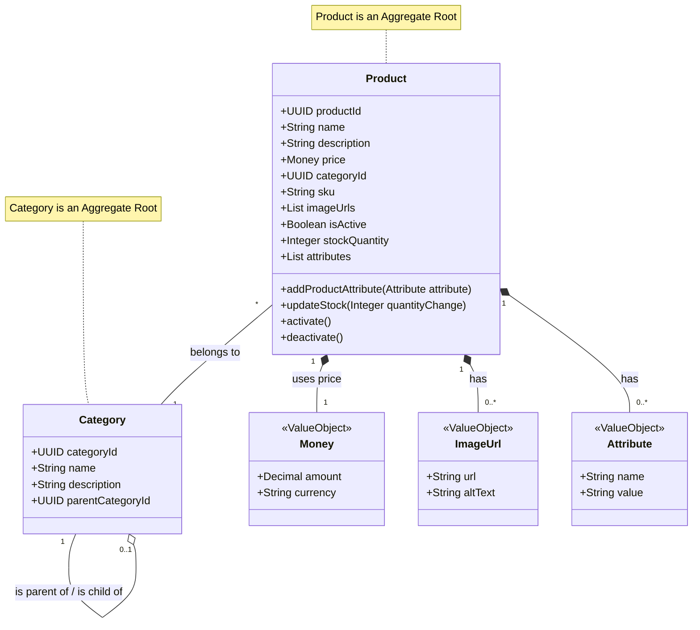

# Product Catalog Bounded Context

This document outlines the design and implementation details for the Product Catalog bounded context.

## 1. Domain Model

The Product Catalog is responsible for managing all information related to products offered in the e-commerce system.

### Key Components:

*   **`Product` (Aggregate Root):**
    *   `ProductId`: Unique identifier (UUID).
    *   `Name`: Name of the product (e.g., "Men's T-Shirt").
    *   `Description`: Detailed description.
    *   `Price`: The price of the product, represented by a `Money` Value Object (amount and currency).
    *   `CategoryId`: Foreign key referencing the `Category` it belongs to.
    *   `SKU`: Stock Keeping Unit, a unique identifier for inventory purposes.
    *   `ImageUrls`: A list of URLs for product images (could be simple strings or a `ImageUrl` VO).
    *   `IsActive`: Boolean indicating if the product is available for sale.
    *   `StockQuantity`: Current available stock. (This might later move to a dedicated Inventory BC, but for MVP, it can live here).
    *   `Attributes`: A list of product-specific attributes (e.g., Size: M, Color: Red). Each attribute could be a simple dictionary or a more structured Value Object/Entity.

*   **`Category` (Aggregate Root):**
    *   `CategoryId`: Unique identifier (UUID).
    *   `Name`: Name of the category (e.g., "Apparel", "Electronics").
    *   `Description`: Optional description of the category.
    *   `ParentCategoryId`: Optional, to allow for sub-categories.

*   **Shared Value Objects:**
    *   `Money`: Represents a monetary value with amount and currency (we already have this in `domain.core.value_objects.Money`).
    *   `ImageUrl`: Could be a simple string or a VO containing the URL and optional alt text.

This model focuses on the information needed for customers to see products and their details, which aligns with the MVP use case: "a customer registers, sees products and makes an order for one of the products."

## 2. Commands and Queries (CQRS)

Based on the domain model and the MVP use case ("customer sees products and makes an order"), here are the initial commands and queries we'll likely need.

### Commands (Write Operations):

*   **Product Management (Admin/Internal):**
    *   `CreateProductCommand`:
        *   Payload: `name`, `description`, `price_amount`, `price_currency`, `category_id`, `sku`, `image_urls`, `stock_quantity`, `attributes`.
        *   Outcome: A new product is created. `ProductCreatedEvent` is raised.
    *   `UpdateProductCommand`:
        *   Payload: `product_id`, plus any fields that can be updated.
        *   Outcome: Product details are updated. `ProductUpdatedEvent` is raised.
    *   `DeactivateProductCommand`:
        *   Payload: `product_id`.
        *   Outcome: Product `isActive` field set to `false`. `ProductDeactivatedEvent` raised.
    *   `ActivateProductCommand`:
        *   Payload: `product_id`.
        *   Outcome: Product `isActive` field set to `true`. `ProductActivatedEvent` raised.
    *   `UpdateStockCommand`: (Could be internal, or part of order processing in future)
        *   Payload: `product_id`, `quantity_change` (can be positive or negative).
        *   Outcome: `StockQuantity` for the product is updated. `StockUpdatedEvent` raised.

*   **Category Management (Admin/Internal):**
    *   `CreateCategoryCommand`:
        *   Payload: `name`, `description`, `parent_category_id` (optional).
        *   Outcome: A new category is created. `CategoryCreatedEvent` raised.
    *   `UpdateCategoryCommand`:
        *   Payload: `category_id`, plus fields to update.
        *   Outcome: Category details updated. `CategoryUpdatedEvent` raised.

### Queries (Read Operations):

*   **For Customers:**
    *   `GetProductByIdQuery`:
        *   Payload: `product_id`.
        *   Response: `ProductDetailsDTO` (containing all relevant product info for display).
    *   `ListActiveProductsQuery`:
        *   Payload: `category_id` (optional filter), `page_number`, `page_size`, `sort_by` (e.g., price, name).
        *   Response: Paginated list of `ProductSummaryDTO` (id, name, price, main image, SKU).
    *   `ListCategoriesQuery`:
        *   Payload: None or `parent_category_id` (to list subcategories).
        *   Response: List of `CategoryDTO` (id, name, description).

*   **For Admin/Internal:**
    *   `GetProductDetailsAdminQuery`: (Might include more fields than customer DTO, e.g. `isActive` explicitly, audit info)
        *   Payload: `product_id`.
        *   Response: `AdminProductDetailsDTO`.
    *   `ListAllProductsAdminQuery`:
        *   Payload: `page_number`, `page_size`, filters (e.g., by activity status, category).
        *   Response: Paginated list of `AdminProductSummaryDTO`.
